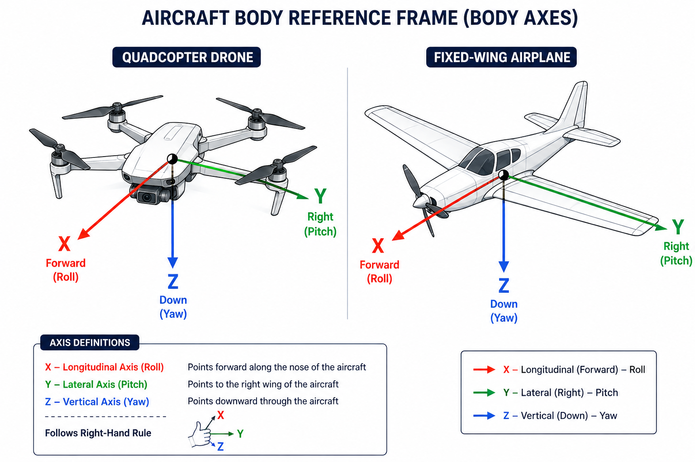
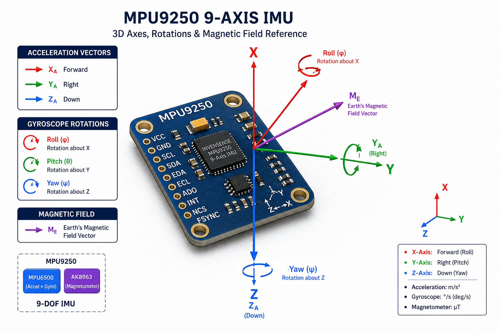

# 9-DOF IMU Complementary Filter & 3D Attitude Estimation

A complete 9-DOF (Degrees of Freedom) orientation tracking system built in MATLAB and Simulink. This project fuses accelerometer, gyroscope, and magnetometer measurements using an adaptive complementary filter to compute real-time Roll, Pitch, and Yaw angles without heading drift. Orientation outputs are rendered in real time using an interactive 3D visualizer.

---

## Coordinate System & Body Reference Frame

The filter follows the standard Aerospace / Robotics North-East-Down (NED) body frame reference convention.

### Axis Definitions
* **X-Axis (Longitudinal / Forward - Red):** Measures Roll ($\phi$) about the forward nose axis.
* **Y-Axis (Lateral / Right - Green):** Measures Pitch ($\theta$) about the wing/side axis.
* **Z-Axis (Vertical / Down - Blue):** Measures Yaw ($\psi$) about the vertical axis pointing downward.

---

## Hardware Sensor Axis Mapping (MPU9250 9-DOF IMU)

The diagram below details the 3D axis alignment, angular rate vectors, and Earth's magnetic field vector ($M_E$) mapped onto the MPU9250 breakout board containing the MPU6500 (Accel + Gyro) and AK8963 (Magnetometer).

* **Acceleration Units:** $\text{m/s}^2$
* **Gyroscope Units:** $\text{deg/s}$
* **Magnetometer Units:** $\mu\text{T}$

---

## Technical Overview & Mathematical Formulation

The filter combines high-frequency angular rate integration with low-frequency absolute gravitational and magnetic reference vectors.

### 1. Accelerometer Tilt Angles (Roll & Pitch)
Assuming quasi-static conditions, Roll ($\phi$) and Pitch ($\theta$) are calculated via trigonometry:

$$\phi_{\text{acc}} = \text{atan2}(a_y, a_z) \cdot \frac{180}{\pi}$$

$$\theta_{\text{acc}} = \text{atan2}\left(-a_x, \sqrt{a_y^2 + a_z^2}\right) \cdot \frac{180}{\pi}$$

### 2. Magnetometer Heading Angle (Yaw)
The magnetometer provides an absolute directional reference to estimate Yaw ($\psi$):

$$\psi_{\text{mag}} = \text{atan2}(-m_y, m_x) \cdot \frac{180}{\pi}$$

### 3. Discrete Complementary Filter Fusion
The filter blends integrated gyro data (high-pass filtered) with tilt/heading vectors (low-pass filtered):

$$\phi_k = \alpha \cdot (\phi_{k-1} + g_x \cdot \Delta t) + (1 - \alpha) \cdot \phi_{\text{acc}}$$

$$\theta_k = \alpha \cdot (\theta_{k-1} + g_y \cdot \Delta t) + (1 - \alpha) \cdot \theta_{\text{acc}}$$

$$\psi_k = \alpha \cdot (\psi_{k-1} + g_z \cdot \Delta t) + (1 - \alpha) \cdot \psi_{\text{mag}}$$

*Where $\alpha = 0.98$, sampling period $\Delta t = 0.01\text{ s}$ (100 Hz), and $g_x, g_y, g_z$ represent angular velocity in degrees per second.*
